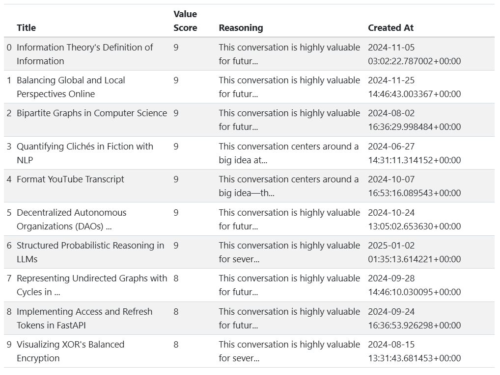
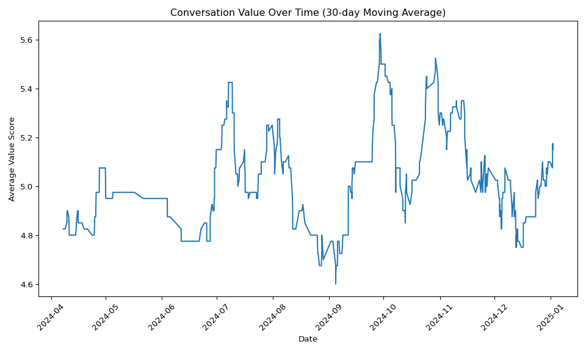

This is a notebook for processing exported Claude conversations to determine which of your conversations with the chatbot are valuable and worth archiving for future reference.

It's inspired by the [claude-export](https://github.com/eudoxia0/claude-export/) notebook by Github user [eudoxia0](https://github.com/eudoxia0).

It uses the [DeepSeek V3](https://platform.deepseek.com/) API to analyze the conversations. DeepSeek's API is extremely low-cost and high-capacity, so we can parallelize the analysis and quickly get a result for hundreds of conversations at a cost of just a few cents per hundred conversations. You will need a DeepSeek account and API key to use this notebook.

# Usage

1. [Export](https://support.anthropic.com/en/articles/9450526-how-can-i-export-my-claude-ai-data) your Claude data.
1. You will get an email with a link to download a .zip file (might have a different extension).
1. Put the `conversations.json` file from the export in the `inputs/` folder.
1. Install [[Quarto](https://quarto.org/)].
1. Install [[uv](https://docs.astral.sh/uv/)].
1. `uv venv`
1. `uv sync`
1. Set your DeepSeek API key in the `DEEPSEEK_API_KEY` environment variable in `.env`.
1. Edit the instructions in `get_value_score` in `notebook.qmd` to tell the AI what criteria you use to decide whether a conversation is valuable and worth archiving.
1. `uv run quarto render notebook.qmd`
1. Open the `notebook.html` file in your browser.

# Example output

